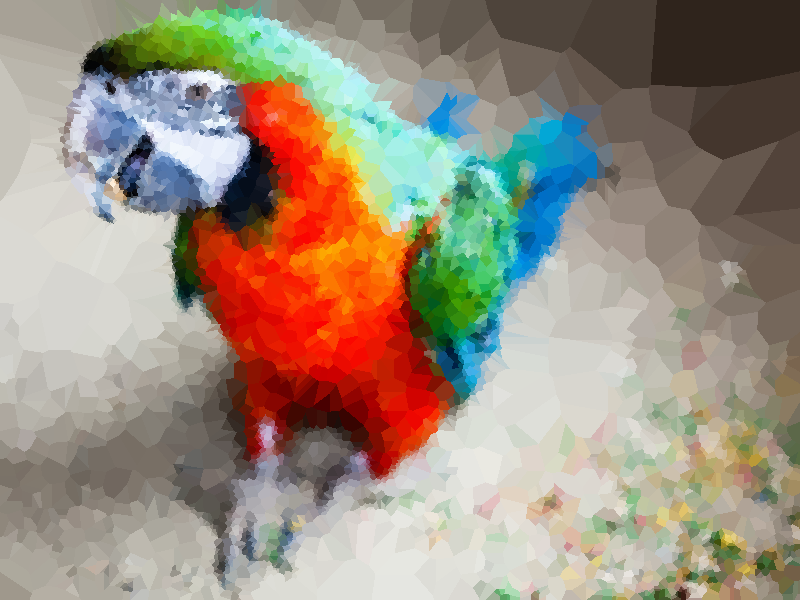
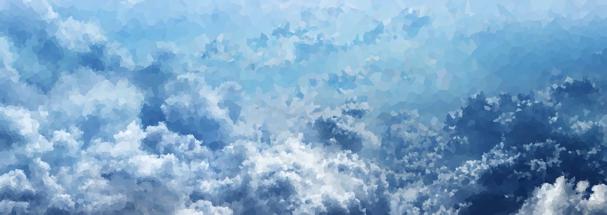

Inspiration from here https://github.com/esimov/triangle

Constructs a set of random verticies based on the intensity of the grayscale of the image.

Colors pixels based on the color of their nearest vertex.

The color of a vertex is simply the color of the original image at the position of the vertex.

