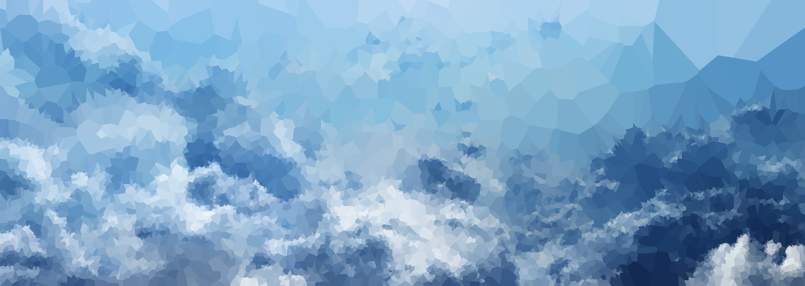

Inspiration from here https://github.com/esimov/triangle

Constructs a set of verticies S at random locations based on the intensity of the grayscale of the input image.

The color of a pixel in the ouput image is based on the "color" of its nearest vertex from S.

The color of vertex V is the average color of the pixels in the input image that are closer to V than to any other vertex.

